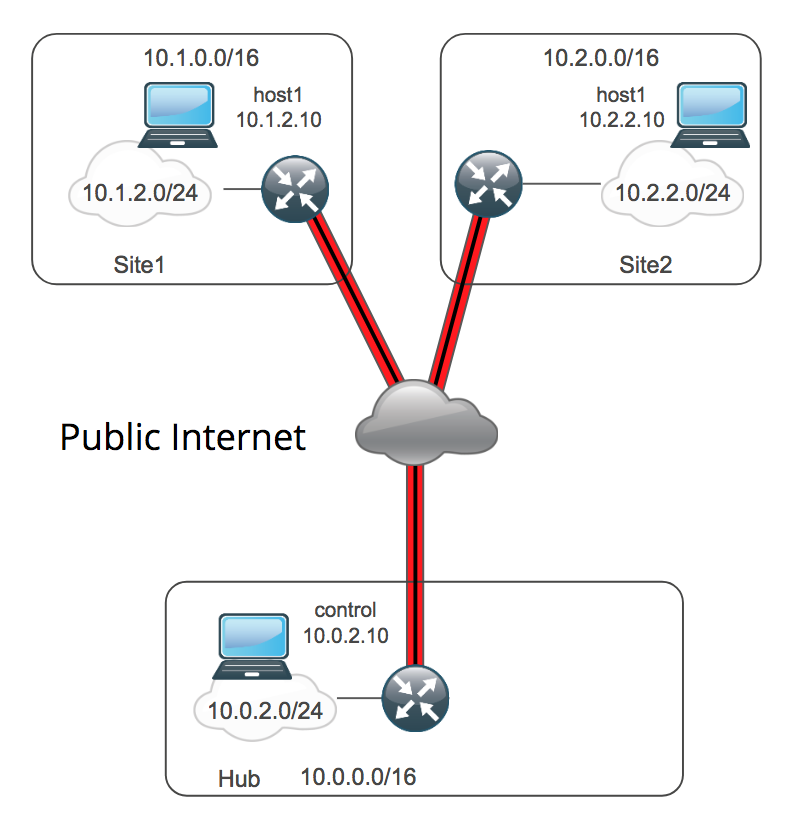

# brkarc-2023_clus2018

This repository contains the Ansible playbooks that set up VPCs (or their equivalents) in AWS, Azure, and OpenStack, then connect them together using a DMVPN overlay using a Cisco Cloud Services Router 1000v.

This repository primary uses 2 Ansible Roles to create the cloud network:

  * [network-dmvpn](https://github.com/ismc/ansible-network-dmvpn.git):  An Ansible Role that deployes a DMVPN overlay over a hub and spoke network.
  * [cloudbuilder](https://github.com/ismc/ansible-cloudbuilder.git): An Ansible Role to build a cloud-agnostic model in a Public Cloud.

Two additional Ansible Roles are leveraged to demonstrate the operational aspects of backup/checkpint/rollback and to dynamically update the Ansible Tower inventory:
  * [network-dmvpn](https://github.com/ismc/ansible-network-dmvpn.git):  An Ansible Role that deployes a DMVPN overlay over a hub and spoke network.
  * [ansible-tower-api](https://github.com/ismc/ansible-tower-api.git): An Ansible Role that updates Ansible Tower Inventory, Hosts, Groups, etc. via the API.

## Topology



## Usage

Since this repository uses submodules, it has to be checked out recursively:

```
git clone git@github.com:ismc/brkarc-2023_clus2018.git --recursive
```

To build the testbed:

```
ansible-playbook -e cloud_model=wan-testbed -e cloud_inventory_file=inventory/wan-testbed.yml build-cloud.yml
```

By default, this will build the model for the wan testbed using cloud keys with the same name as your username in the AWS us-east-1 region.  Refer to extra vars in the [cloudbuilder](https://github.com/ismc/ansible-cloudbuilder.git) Role for more detail on changing these defaults.

To run the DMVPN Integration tests:

* Set the baseline system and interface configuration:

```
    ansible-playbook -i inventory network-system.yml
```

* (Optional) Checkpoint the routers after the initial configuration and before the DMVPN deployment.

```
    ansible-playbook -i inventory network-checkpoint.yml
```

* Deploy the DMVPN overlay:

```
    ansible-playbook -i inventory network-dmvpn.yml
```

* Check to make sure that DMVPN overlay as properly deployed

```
    ansible-playbook -i inventory network-dmvpn-check.yml
```

* (Optional) Rollback the router configuration to the state before the DMVPN overlay was deployed.

```
    ansible-playbook -i inventory network-rollback.yml
```

To destroy the testbed:

```
ansible-playbook -e cloud_model=wan-testbed -e cloud_inventory_file=inventory/wan-testbed.yml destroy-cloud.yml
```
